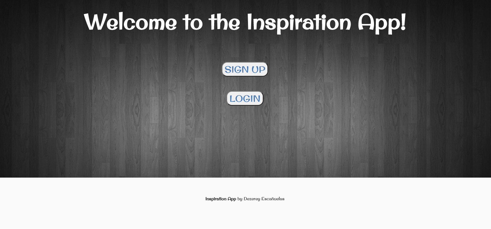
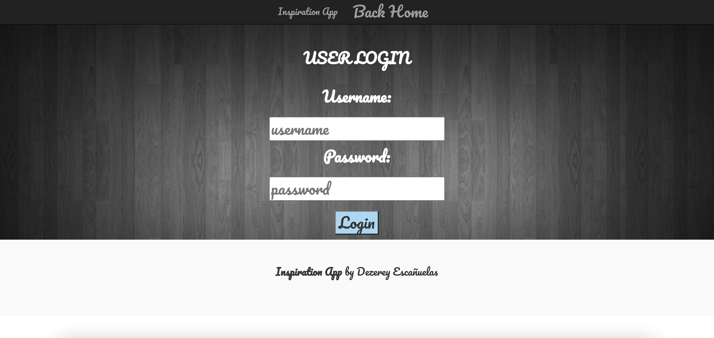
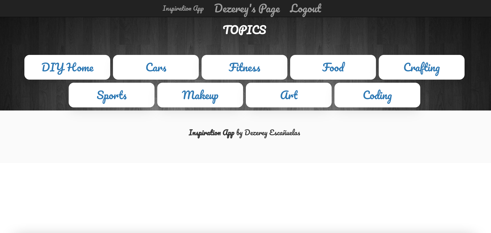
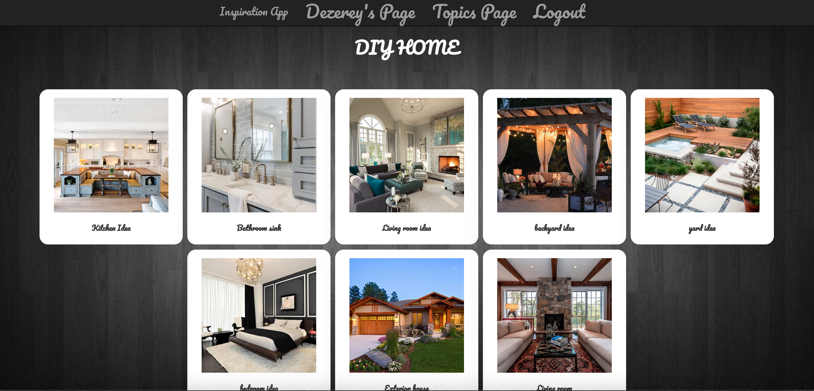
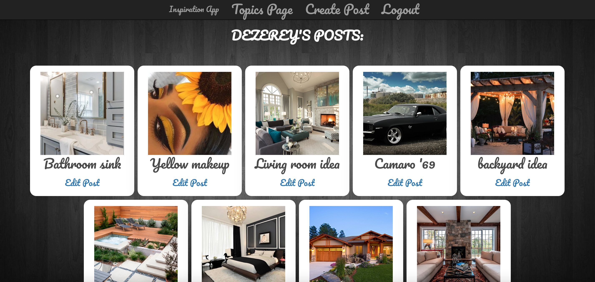
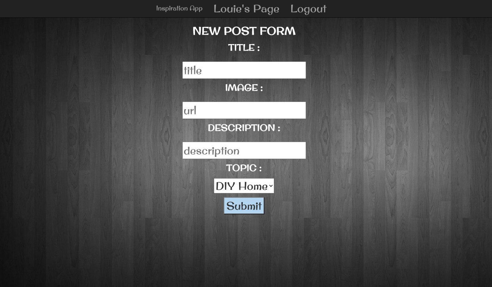

# Inspiration App

**Author:** Dezerey Escañuelas

## Project Summary

The Inspiration App was created for those moments when someone might feel stuck on their project or goals and needs some motivation. Although everyone has different interests, hopefully, through this application there could be a post that will inspire someone to start a goal or continue to reach their goal.

In this application, the user will sign up / log in and get redirected to a page displaying different topics. The user will be able to select a topic and view the inspirational posts relating to that topic. The user also has the ability to click on a post to see more information (a description and a user). The user also has their own user page where they can see all of their posts, create a new post, and edit or delete existing posts.

## Technology Used

HTML, CSS, JavaScipt, Express, Mongoose, MongoDB, Bulma, Bootstrap

## Screenshots

## Getting Started

- To open app click => [Inspiration App](https://seir-project2-inspirationapp.herokuapp.com/)
- Create an account and log in.
- Select a topic you are interested in and view the inspirational posts from other users.
- When creating a post: add a title, paste an image url address, add a description (add the source if it is not your own image), and select a topic from the dropdown.

## Models

User Model:

- username: { type: String, unique: true, required: true },
- password: { type: String, required: true },
- posts: [
  {
  type: mongoose.Schema.Types.ObjectId,
  ref: "Post",
  },
  ],

Post Model:

- title: { type: String, required: true },
- image: { type: String, required: true },
- body: { type: String, required: true },
- topic: { type: String, required: true },
- user: { type: String, required: true },

## Route Map

| Method | Endpoint             | Resource/View                                     |
| ------ | -------------------- | ------------------------------------------------- |
| GET    | "/"                  | Welcome page with sign up/ sign in (welcome.ejs)  |
| GET    | "/auth/signup"       | Sign up page (auth/signup.ejs)                    |
| POST   | "/auth/signup"       | Creates the user and password salting/hashing     |
| GET    | "/auth/login"        | Login Page (auth/login.ejs)                       |
| POST   | "/auth/login"        | Checks if user exists and password matches        |
| GET    | "/auth/logout"       | removes user from session                         |
| GET    | "/topics"            | List of topics (topics.ejs)                       |
| GET    | "/topics/:topic"     | Displays all posts from one topic (topicpage.ejs) |
| GET    | "/userpage"          | Display all posts from the user (userpage.ejs)    |
| GET    | "/userpage/new       | Creates a new post form (posts/new.ejs)           |
| POST   | "/userpage"          | Creates the post                                  |
| GET    | "/userpage/:id/edit" | Edit post form (posts/edit.ejs)                   |
| PUT    | "/userpage/:id"      | Updates post                                      |
| DELETE | "/userpage/:id"      | Delete a post                                     |
| GET    | "/post/:id"          | Shows a post information (posts/show.ejs)         |

## Next Steps

- As a user be able to add more topics but not be allowed to add multiples of the same topic
- As a user be able to add comments
- Have a reporting system
- Add Inspiration points(likes) —— can filter from recent or highest points to lowest on the index page. At the end of the year have a hall of fame for posts with the highest inspiration points that year.
- As a user, have the ability to contact the user who made a post (on their page they will receive a private message)
